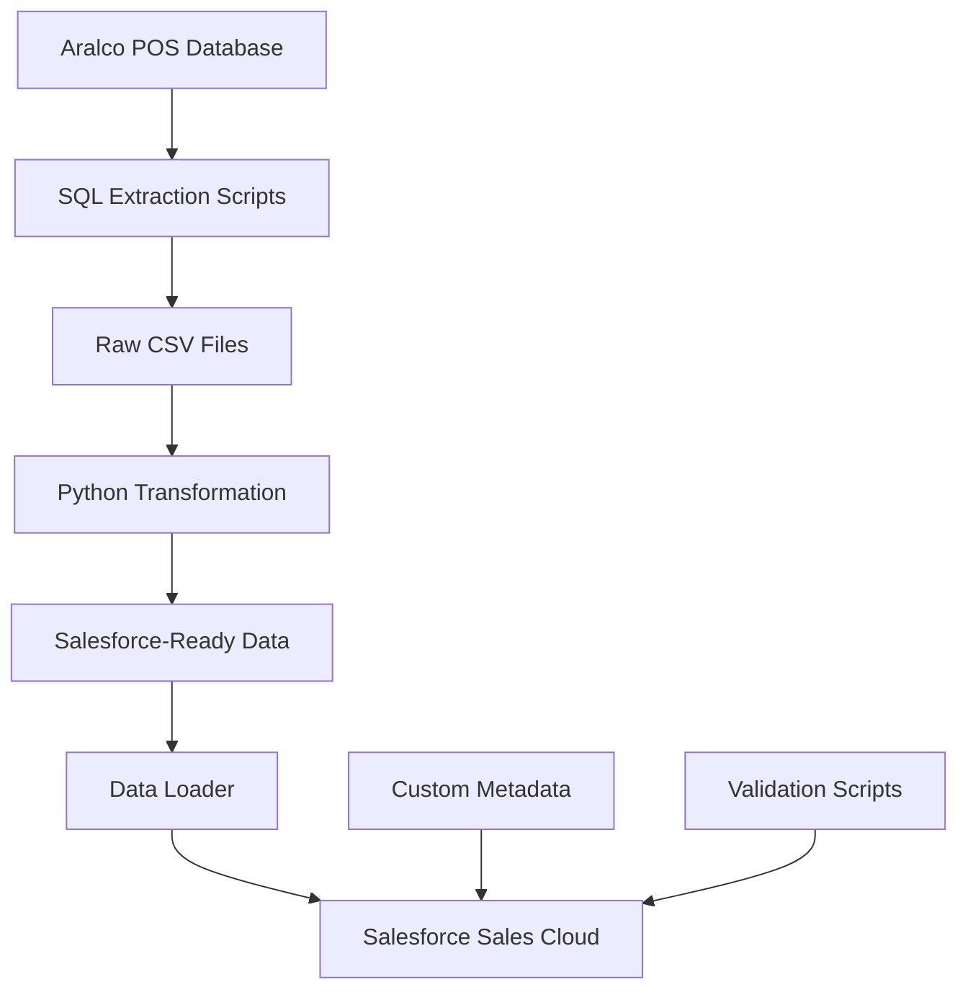

# 🚀 Aralco POS to Salesforce Migration

> **Comprehensive migration strategy and implementation guide for transitioning from Aralco POS to Salesforce Sales Cloud**

[](https://github.com/abhishek-notes/aralco-salesforce-migration)
[](https://github.com/abhishek-notes/aralco-salesforce-migration)
[](https://github.com/abhishek-notes/aralco-salesforce-migration)

## 📊 Migration Scope

| Data Type | Records | Description |
|-----------|---------|-------------|
| **Customers** | 13,111 | Business and individual accounts |
| **Products** | 37,028 | Active product catalog with inventory |
| **Transactions** | 37,677 | Sales orders with 49,788 line items |
| **Total** | ~150,000 | Complete migration scope |

## 🎯 What's Included

### 📋 **Strategic Planning**
- [**Migration Strategy**](MIGRATION_STRATEGY.md) - 8-week phased implementation plan
- [**Executive Summary**](SUMMARY.md) - Business overview and next steps
- [**Progress Tracking**](PROGRESS.md) - Detailed completion status

### 🛠️ **Technical Implementation**
- [**SQL Extraction Scripts**](exports/sql_scripts/) - Customer, product, and transaction exports
- [**Python Transformation**](transform_data.py) - Data cleansing and formatting
- [**Salesforce Metadata**](salesforce-metadata/force-app/) - Custom fields and objects
- [**Data Loader Config**](dataloader/process-conf.xml) - Automated import setup

### 📖 **Documentation**
- [**Migration Runbook**](MIGRATION_RUNBOOK.md) - Step-by-step execution guide
- [**Data Dictionary**](DATA_DICTIONARY.md) - Complete field specifications
- [**Field Mapping**](exports/DATA_MAPPING_ARALCO_TO_SALESFORCE.csv) - 60+ detailed mappings

### ✅ **Validation & Testing**
- [**Validation Scripts**](validation/post_migration_validation.sql) - Data integrity checks
- [**Quality Assurance**](MIGRATION_RUNBOOK.md#validation) - Testing procedures

## 🏗️ Architecture Overview



## 🚀 Quick Start

### Prerequisites
- Salesforce Sales Cloud (Enterprise+)
- SQL Server access to Aralco database
- Data Loader v50.0+
- Python 3.7+

### 1. **Review Strategy**
```bash
# Start with the executive summary
cat SUMMARY.md

# Review the detailed migration strategy  
cat MIGRATION_STRATEGY.md
```

### 2. **Set Up Environment**
```bash
# Deploy Salesforce metadata
sfdx force:source:deploy -p salesforce-metadata/force-app

# Configure Data Loader
cp dataloader/process-conf.xml /path/to/dataloader/
```

### 3. **Extract Data**
```sql
-- Run in SQL Server Management Studio
\i exports/sql_scripts/01_extract_customers.sql
\i exports/sql_scripts/02_extract_products.sql  
\i exports/sql_scripts/03_extract_transactions.sql
```

### 4. **Transform Data**
```bash
# Clean and format for Salesforce
python3 transform_data.py
```

### 5. **Execute Migration**
```bash
# Follow the detailed runbook
cat MIGRATION_RUNBOOK.md
```

## 📈 Key Features

### 🎯 **Smart Data Mapping**
- Business vs Person Account logic
- Phone number standardization  
- Email validation and cleansing
- Currency and date formatting

### 🛡️ **Risk Mitigation**
- External ID strategy for data integrity
- Comprehensive rollback procedures
- Validation at every step
- Error handling and logging

### 📊 **Quality Assurance**
- Record count reconciliation
- Financial total validation
- Relationship integrity checks
- Business rule verification

### 🔄 **Phased Approach**
| Week | Phase | Activities |
|------|-------|-----------|
| 1-2 | Foundation | Metadata deployment, validation |
| 3-4 | Master Data | Products, customers, suppliers |
| 5-6 | Transactions | Historical orders and line items |
| 7-8 | Go-Live | Final validation and cutover |

## 🔍 Data Quality Insights

### ⚠️ **Identified Issues**
- 70% of customers missing email addresses
- Phone numbers need standardization
- Some incomplete customer names
- No foreign key constraints in source

### ✅ **Solutions Provided**
- Automated email validation
- Phone formatting algorithms
- Name generation for incomplete records
- External ID mapping for relationships

## 🏆 Success Metrics

- ✅ **100%** customer data preservation
- ✅ **Zero** data loss during migration  
- ✅ **2 years** of transaction history
- ✅ **Complete** financial reconciliation
- ✅ **Maintained** referential integrity

## 📚 File Structure

```
📁 aralco-salesforce-migration/
├── 📄 SUMMARY.md                    # Executive overview
├── 📄 MIGRATION_STRATEGY.md         # Detailed strategy  
├── 📄 MIGRATION_RUNBOOK.md          # Step-by-step guide
├── 📄 DATA_DICTIONARY.md            # Field specifications
├── 📄 PROGRESS.md                   # Completion tracking
├── 📁 exports/
│   ├── 📄 DATA_MAPPING_*.csv        # Field mappings
│   └── 📁 sql_scripts/              # Extraction queries
├── 📁 salesforce-metadata/
│   └── 📁 force-app/                # Custom fields & objects
├── 📁 dataloader/
│   └── 📄 process-conf.xml          # Import configuration
├── 📁 validation/
│   └── 📄 post_migration_*.sql      # Validation queries
├── 📄 transform_data.py             # Data transformation
└── 📄 analyze_database.py           # Database analysis
```

## 🤝 Implementation Support

### 📞 **Getting Started**
1. Review [SUMMARY.md](SUMMARY.md) for business overview
2. Follow [MIGRATION_RUNBOOK.md](MIGRATION_RUNBOOK.md) for execution
3. Use [DATA_DICTIONARY.md](DATA_DICTIONARY.md) for field reference
4. Run validation scripts for data integrity

### 🛠️ **Technical Requirements**
- **Source**: SQL Server with Aralco POS database
- **Target**: Salesforce Sales Cloud (Enterprise+)
- **Tools**: Data Loader, SFDX CLI, Python 3.7+
- **Access**: System Administrator profile in Salesforce

### 📊 **Monitoring & Validation**
- Pre-migration data counts
- Post-migration validation queries
- Financial reconciliation reports
- Business process testing

## 📝 License

This project is provided as-is for educational and business purposes. Please review and adapt according to your specific requirements.

---

<div align="center">

**🧠 Generated with Claude Code**  
*Co-Authored-By: Claude <noreply@anthropic.com>*

[⭐ Star this repo](https://github.com/abhishek-notes/aralco-salesforce-migration) if it helped you!

</div>